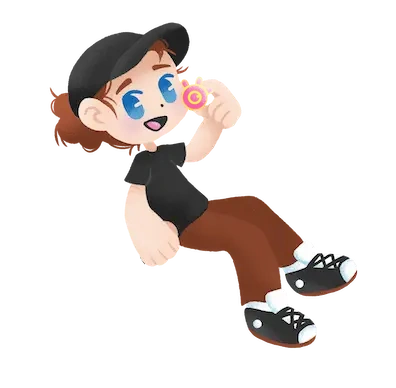

# EYE CATCHER

Eye Catcher is a customizable browser game built with plain HTML, CSS, JavaScript, and Canvas API. Catch the collectible eyes, avoid the glitches, and reach the target score as quickly as possible.

<br>Play it: **[Eye Catcher on GitHub Pages](https://iainmannix.github.io/eye-catcher-game/)**

[](https://iainmannix.github.io/eye-catcher-game/)



> [!IMPORTANT]
> The included artwork is by **Spiders.n.ciders** and is not open source. It is present only in the original playable demo. Replace every file in [`assets/`](./assets) with your own art before redistributing, remixing, or publishing unless you have separate permission from the artist.

## In this repository

- A complete playable browser game with keyboard, mouse, and touch controls
- A single [`config.js`](./config.js) file for gameplay settings and artwork paths
- A clearly documented [`assets/`](./assets) folder for replacing artwork
- Automatic GitHub Pages deployment
- No framework, package installation, or build step

## Make your own version

1. Select **Fork** at the top of this repository
2. Replace every file in [`assets/`](./assets) with your own art but keep the existing filenames and file formats
3. If you prefer different filenames, update their paths in [`config.js`](./config.js)
4. Adjust scoring, lives, spawn points, and the target score in [`config.js`](./config.js)
5. Enable GitHub Pages with **GitHub Actions** as the source in your repository settings

Every push to your `main` branch will update your playable GitHub Pages version automatically.

Your assets should use transparent backgrounds for sprites. Similar dimensions are helpful but not required because the game scales each asset automatically.

| File | Purpose |
| --- | --- |
| `player-open.webp` | Player character |
| `player-blink.webp` | Alternate blinking player frame |
| `eye-collectible.webp` | Positive collectible |
| `glitch-at.webp`, `glitch-404.webp`, `glitch-symbols.webp` | Score hazards |
| `glitch-heart.webp` | Life hazard |
| `time-power-up.webp` | Slow-time power-up |
| `sky-*.webp` | Cycling background layers |
| `eye-catcher-title.webp` | Start-screen title |
| `eye-catcher-splash.webp` | Start and game-over art |
| `eye-catcher-run-complete.webp` | Completion art |
| `repository-preview.webp` | Repository preview image |

## Preview while you work

Because the game uses JavaScript modules you can serve the folder with any static server rather than opening `index.html` directly. For example:

```sh
python3 -m http.server 8080
```

Then open `http://localhost:8080` and refresh the browser after updates. 

## Controls

- Keyboard: Left/Right arrows or A/D
- Pause/resume: Space or P
- Touch or mouse: Tap and drag inside the game

## Licensing

The source code is available under the [MIT License](./LICENSE).

The included visual artwork is by **Spiders.n.ciders**, is provided only for this playable demo, and is **not** licensed under MIT. It must be replaced before redistributing, remixing, or publishing your own version unless you have obtained separate permission from the artist. See [`assets/README.md`](./assets/README.md).

## Contributing

Bug fixes, accessibility improvements, documentation updates, and gameplay enhancements are welcome. Contributions can't contain new artwork without clear redistribution permission.
